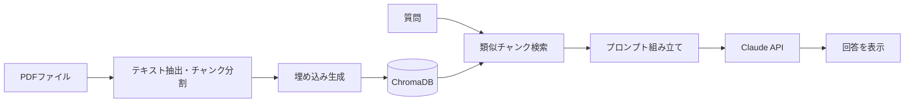

# TechDoc QA Bot

[](https://github.com/nd-3/llm_learning_journey/actions/workflows/ci.yml)

技術ドキュメント(PDF)の内容について、自然言語で質問できるRAG構成のQAツールです。

新しい技術を学ぶ際、膨大な公式ドキュメントや複数の技術ブログを読む中で、「この機能について、もっと簡潔に知りたい」「複数のページにまたがる情報を一箇所で確認したい」と感じることが多々ある。

この体験から、自身の課題を解決するツールとして、RAG(検索拡張生成)技術を用いた本プロジェクトの開発を開始しました。このツールは、開発者がより本質的な学びに集中できる環境を提供することを目指しています。

## 実行例

```text
$ python src/main.py data/sample.pdf
既存のベクトルDBを再利用します: /home/ddaai/Programming/llm_learning_joureney/03_portfolio/techdoc-qa-bot/data/chroma_db

質問を入力してください(終了するには 'exit' または 'quit' と入力)。

質問> Pythonとは何ですか?

回答: # Pythonについて

参考資料に基づいて説明します。

Pythonは、**Guido van Rossum氏によって1991年に公開された汎用プログラミング言語**です。

## 主な特徴：

1. **シンプルで読みやすい文法** - 初心者にも学びやすい言語として広く知られています

2. **インデント（字下げ）によるブロック構造** - 波括弧ではなく、コードのインデントの深さでプログラムの構造を表現するのが特徴です

3. **インタプリタ言語** - 書いたコードをすぐに実行して結果を確認できます

4. **動的型付け言語** - 変数の型を事前に宣言する必要がありません

## 用途：

Web開発、データ分析、機械学習、自動化スクリプト作成など、非常に幅広い分野で活用されています。

## エコシステム：

pip（パッケージ管理ツール）により、NumPy、pandas、Django、FastAPIなど豊富なライブラリを簡単にインストールして利用できます。

質問> exit
終了します。
```

(初回起動時は上記の前に、PDF読み込み・チャンク分割・埋め込み生成のログが表示されます)

## 主な機能(実装済みのみ記載)

- PDF 1ファイルの読み込み・チャンク分割
- 埋め込み生成と ChromaDB への保存(初回のみ。2回目以降は既存DBを再利用)
- 質問文に対する類似チャンク検索(上位4件)
- 検索結果を文脈として Claude API で回答生成(コンソール対話)

## アーキテクチャ



## 技術スタック

### 実装済み

| 分類 | 技術 |
|---|---|
| 言語 | Python 3.10 |
| RAGフレームワーク | LangChain(langchain, langchain-community, langchain-text-splitters) |
| ベクトルDB | ChromaDB(ローカル永続化) |
| LLM | Claude Haiku 4.5(Anthropic API 経由、langchain-anthropic) |
| 埋め込みモデル | text-embedding-3-small(OpenAI Embeddings、評価により選定 → docs/evaluation.md) |
| PDF読み込み | pypdf(langchain_community.document_loaders.PyPDFLoader 経由) |
| 環境変数管理 | python-dotenv |
| 動作環境 | WSL2(Ubuntu) |

### 今後導入予定(未実装)

FastAPI・Docker などは下のロードマップ参照。**現時点では未実装です。**

## フォルダ構成

```text
techdoc-qa-bot/
├── .env.example         # 環境変数のテンプレート(ダミー値)
├── data/
│   └── sample.pdf        # 動作確認用サンプルPDF(Python入門、日本語)
├── docs/
│   └── requirements.md   # 要件定義書
├── requirements.txt
└── src/
    └── main.py            # RAGパイプライン一式(読込・分割・埋め込み・検索・回答生成)
```

`.env`(実際のAPIキー)と `venv/`、`data/chroma_db/`(実行時に自動生成されるベクトルDB)は `.gitignore` によりコミット対象外です。

## セットアップ

```bash
git clone https://github.com/nd-3/llm_learning_journey.git
cd llm_learning_journey/03_portfolio/techdoc-qa-bot

python3 -m venv venv
source venv/bin/activate
pip install -r requirements.txt

cp .env.example .env
# .env を編集して ANTHROPIC_API_KEY と OPENAI_API_KEY を設定してください

python src/main.py data/sample.pdf
```

## テスト

判定ロジック(キーワード一致・空白正規化)、ベクトルDBディレクトリ名の命名規則、QAデータセットの構造整合性をpytestで検証しています。外部API(OpenAI/Anthropic)は呼ばないため、APIキーなしで実行できます。

```bash
pip install -r requirements-dev.txt
pytest -v
```

GitHub Actions(`.github/workflows/ci.yml`)で`push`/`pull_request`時に自動実行されます。

## 評価用文書の入手

RAG精度評価(`evals/`)では、`data/sample.pdf` に加えて京都大学が公開している「プログラミング演習 Python 2023」(260ページ)も評価対象文書として使用します。入手元: https://repository.kulib.kyoto-u.ac.jp/dspace/handle/2433/285599 。このページからPDFをダウンロードし、`data/kyodai_python_2023.pdf` に配置してください。公開物の再配布を避けるため、このPDF自体はリポジトリにコミットしていません(`.gitignore`で除外)。

## ロードマップ

- [x] RAGパイプラインのMVP実装(単一PDF・コンソール対話)
- [x] RAG精度の評価(想定QAセットを用意し正答率を計測)
- [x] chunk_size / top_k / 埋め込みモデルの選定理由をドキュメント化
- [x] pytest による基本テスト + GitHub Actions CI
- [ ] 複数ドキュメント対応
- [ ] 会話履歴の保持
- [ ] ストリーミング応答
- [ ] Web UI 化(FastAPI)

📝 評価の裏側はZenn記事にまとめています: https://zenn.dev/nd3/articles/rag-eval-embedding-comparison
